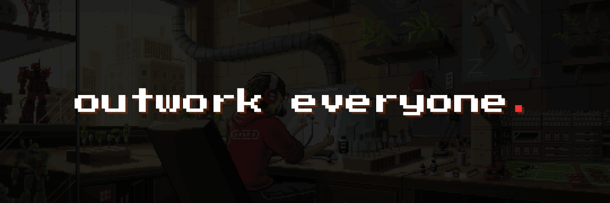

# Oi, World! Im Anjal 👋

I'm a **Computer Science Engineer** with a knack for building web applications. Fascinated by the potential of **Web3**, I'm passionate about learning **smart contracts** and harnessing the power of **decentralization** to make the world a better place. Let's connect and build the future of the internet together! 🌐🚀

- 💼 Got a freelance gig? Hit me up via <a href="mailto:anjalbuilds@gmail.com">email.</a>
- 💬 Curious? Just ask!

## 📈 My GitHub stats

  

    
    
  

  
   
 

<table>
  <tr>
    <td>
      
    </td>
    <td>
      
    </td>
    <td>
      
    </td>
  </tr>
</table>

  &nbsp;&nbsp;
  &nbsp;&nbsp;
  &nbsp;&nbsp;
  &nbsp;&nbsp;
  &nbsp;&nbsp;
  &nbsp;&nbsp;
  &nbsp;&nbsp;
  &nbsp;&nbsp;

